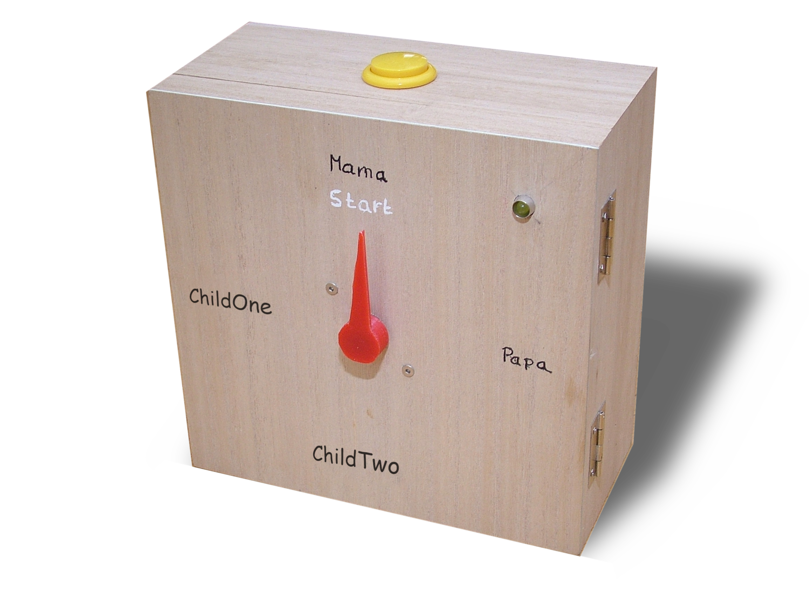
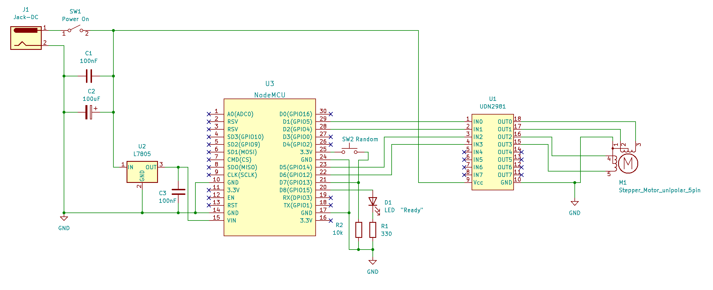

# Familiy-TWatch

Who decides what we're going to watch on TV tonight? If this question sounds familar to you then this device is for you. This watch helps you and your family to determine who will decide what the family watches on TV tonight.

The Watch TV Watch uses the current date to determine whose turn it is to decide what the family will watch on TV tonight. It also has a button that triggers a random selection regardless of the current date. There are also rumors that the Watch TV Watch has a secret web interface to manipulate the final decision, but -- ssshht! -- maybe not everyone needs to know those technical details.

Please note the lovely clock hand! It was a quick design with tinkercad. After 3D-printing it I warmed it up a bit using a heat gun and pressed it onto the motor shaft ... et voilà! The STL file is also available here.

# Schematic

This wiring diagram may look unusual in some aspects. Feel free to be inspired, but don't use this diagram as the perfect reference. IT IS A HACK AND REPRODUCING IT IS ON YOUR OWN RISK!

The circuit uses an ESP8266 (NodeMCU) in order to Wifi and provide a simple web interface.

The stepper motor was recycled from an old flatbed scanner or laser printer. I must admit that I forget where it really was from.

Using the UDN2981 as motor driver may look unusual. I still have many of these chips from another project so it was a very easy solution. Treating the motor like this may be suboptimal, but worked for me. I recommend rethinking this approach and possibly choose another way.

The ESP8266 is a 3.3V level device but the output of the logic pins is high enough to trigger the inputs of UDN2981. I don't see any need for a level shifter here. However, it probably would be better to put driver transistors right behind the output pins. For me it was good enough without them.

The ESP8266 is powered through it's VIN pin which allows higher supply voltages (read the specs).

The entire circuit is powered using an old 15V power supply. Choosing this value depends on the motor, the voltage range of the UDN2981 and the 7805. The 7805 breaks it down for the ESP8266. 

